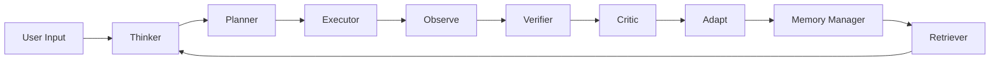
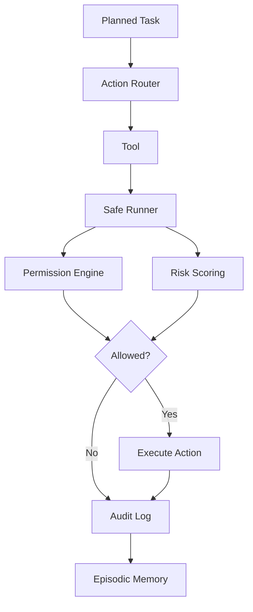

# Architecture

## Overview

`autonomous-operator` is organized around a memory-first control plane:

1. Input enters via CLI (`ui/cli`).
2. Core loop (`core/control_loop.py`) runs Plan -> Act -> Observe -> Evaluate -> Adapt.
3. Planner generates tasks (`planner/task_decomposer.py`).
4. Executor routes tasks to tools (`executor/action_router.py`) through governance checks.
5. Every step emits events (`core/event_bus.py`) and writes episodic memory.
6. Consolidation turns episodes into semantic/procedural updates (`memory/consolidation`).

## Cognitive Flow Diagram

## Safety and Tool Execution Flow

## Subsystems

- `core`: orchestration loop, runtime state, policy runtime.
- `governance`: permission enforcement, risk scoring, audit trail, budget guard.
- `memory`: SQL-backed memory types plus retrieval and consolidation.
- `llm`: provider abstraction and prompt tools.
- `vision`: VLM/OCR routing with optional dependencies.
- `os_controller`: windows automation scaffolding guarded by policy.
- `world_model`: environment snapshot and evidence indexing.
- `planner`: task decomposition and lightweight execution plans.
- `executor`: safe runner, action router, rollback checkpoints.
- `tools`: tool interfaces and built-in safe/mock/system/dev tools.

## Persistence

- SQLite DB: `workspace/ao.db`
- Audit log JSONL: `logs/audit.jsonl`
- Workspace mutation boundary: `workspace/`

## Safety Model

- Safe mode defaults in `config/permissions.yaml`.
- Any tool execution passes through:
  - `governance/permission_engine.py`
  - `governance/risk_scoring.py`
  - `executor/safe_runner.py`
- Rollback checkpoints for workspace file changes via `executor/rollback_manager.py`.
